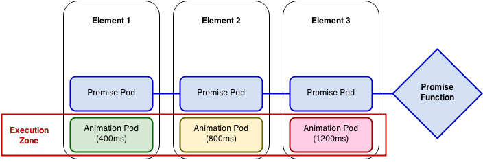

# jquery.hx

#### A hardware-accelerated animation library for mobile and desktop.

=====

## Overview

hx is a JavaScript animation library that couples the slick animation capabilities of CSS3 with the power and flexibility of JS, making complex animation sequences a breeze. It's written as a jQuery plugin and uses the familiar syntax:

```javascript
$('selector').hx( arguments );
```

=====

## Contents
* [__The Basics__](#the-basics)
    * [Beans & Pods](#beans--pods)
    * [Queueing](#queueing)
    * [Promises](#promises)
* [__Animations__](#animations)
    * [General Syntax](#general-syntax)
    * [Operators, Values, and Persistent States](#operators-values-and-persistent-states)
    * [Predefined Style Properties](#predefined-style-properties)
    * [animate vs. iterate](#animate-vs-iterate)
* [__Options__](#options)
    * [Parameters](#parameters)
    * [Easing](#easing)
* [__Methods__](#methods)
    * [Overview](#overview-1)
    * [Static Methods](#static-methods)
    * [Synchronous Methods](#synchronous-methods)
    * [Asynchronous Methods](#asynchronous-methods)
* [__Events__](#events)
* [__Troubleshooting__](#troubleshooting)
    * [Transform Order](#transform-order)
    * [Queue Jams](#queue-jams)
* [__Compatibility__](#compatibility)
* [__Dependencies__](#dependencies)
* [__Build Instructions__](#build-instructions)

=====

## The Basics

### Beans & Pods

The hx method accepts a single transformation object, or __bean__:

```javascript
$('selector').hx({
    ...
});
```

as well as an array of beans, or __pod__:

```javascript
$('selector').hx([
    { ... },
    { ... }
]);
```

* Pods execute _synchronously_, meaning each pod in the queue will not run until the pod before it has been resolved. A pod will be resolved once all of its beans have been resolved.
* By default, beans of the same type execute _synchronously_. Within a pod, each bean<sub>a</sub> will not run until the bean<sub>a</sub> before it has been resolved.
* Beans of different types execute _asynchronously_. Within a pod, bean<sub>a</sub> and bean<sub>b</sub> can run simultaneously.

It's important to note that passing a transformation to the hx method will always create a pod. In the following snippet, the transform and opacity beans will execute simultaneously because they are in the same pod:

```javascript
$('selector').hx([
    {
        type: 'transform'
    },
    {
        type: 'opacity'
    }
]);
```

However, if we separate the beans into two hx calls, the second pod will not execute until the first pod is resolved:

```javascript
$('selector')
.hx({
    type: 'transform'
})
.hx({
    type: 'opacity'
});
```

### Queueing

Each time ```$('selector').hx( ... )``` is invoked, a __pod__ is being pushed to a queue for each element returned by ```'selector'```. Each element has its own queue which executes independently. This allows us to do things like:

```javascript
$('selector1').hx({
    ...
    duration: 400
});

$('selector2').hx({
    ...
    duration: 800
});

$('selector3').hx({
    ...
    duration: 1200
});

$('selector1, selector2, selector3').hx( 'done' , function() {
    // this function will be executed after 1200ms
});
```

The following diagram illustrates how the queues for each element in the previous example will be executed. Since we used the selector ```'selector1, selector2, selector3'```, the ```done``` function will not run until all of the associated promise pods have been resolved:



1. An animation pod is pushed to each queue.
2. Promise pods associated with the ```done``` function are pushed to each queue.
3. As each animation pod finishes running, the promise pod that follows it will be resolved.
4. Once all of the promise pods have been resolved, the promise function is executed.

### Promises

hx is bundled with the latest promises <a href="http://s3.amazonaws.com/es6-promises/promise-1.0.0.min.js" target="_blank">polyfill</a>, so it will work even in browsers that have not yet implemented promises. If you're not familiar with the concept of promises, you may find these resources helpful:
* <a href="http://www.html5rocks.com/en/tutorials/es6/promises/" target="_blank">Intro to Promises</a>
* <a href="https://developer.mozilla.org/en-US/docs/Web/JavaScript/Reference/Global_Objects/Promise" target="_blank">MDN Promises Documentation</a>

=====

## Animations

### General Syntax

#### Beans

Every hx animation bean will fall into one of two categories:

1. Style types with a single value (like opacity)
```javascript
{
    type: String
    value: Variant
}
```

2. Style types with multiple components (like transform or filter)
```javascript
{
    type: String
    component1: Variant
    component2: Variant
    ...
}
```

#### Pods

A pod must contain at least one bean:
```
[
    {bean-0},
    {bean-1},
    ...
    {bean-n}
]
```

A pod will also accept timing callbacks that are executed while the pod is running:
```
[
    function-0,
    function-1,
    ...
    function-n
]
```

Two arguments are passed to each timing callback. `elapsed` is the time (ms) that has elapsed since the pod started running. `progress` is an array containing the percent completion for each bean in the pod.
```javascript
function( elapsed , progress ) {
    // ...
}
```

### Operators, Values, and Persistent States
Assignment operators (`+=`, `-=`, `*=`, `/=`, and `%=`) can be used to perform relative changes:
```javascript
$('selector').hx({
    type: 'transform',
    rotateZ: '-=1',
    translate: {y: '+=1'}
});
```

A numeric value represents an absolute transform:
```javascript
$('selector').hx({
    type: 'transform',
    translate: {y: 100}
});
```

All properties will also accept a function that returns the appropriate argument:
```javascript
$('selector').hx({
    type: 'transform',
    translate: function( element , i ) {
        return {y: (i * 50)};
    }
});
```

Style information will persist until the property is reset:
```javascript
$('selector').hx({
    type: 'transform',
    translate: {x: 50}
});

// some time later...

$('selector').hx({
    type: 'transform',
    translate: {y: 100}
});

// the translate.x component persists
// so the element is translated to (50,100,0)
```

A property can be reset by setting it to null:

```javascript
$('selector').hx({
    type: 'transform',
    translate: null
});

// the element is translated to (0,0,0)
```

When a property is reset, hx removes it from the style string. To force hx to write default values, pass an empty object or string, depending on the type of arguments that property requires:

```javascript
$('selector').hx([
    {
        type: 'opacity',
        value: ''
    },
    {
        type: 'transform',
        translate: {},
        rotateZ: ''
    }
]);

// opacity: 1; transform: translate3d(0,0,0) rotateZ(0);
// is written to the element's style string
```
* __NOTE:__ For properties like translate that require an object, this only works if the property does not have any stored values. Otherwise, you must explicitly pass the defaults, i.e. `{x: 0, y: 0, z: 0}`.


### Predefined Style Properties

| Type | Property | Defaults | Hardware-Accelerated |
| ---- | ---- | -------- | --------------------- |
| _transform_ | __translate__ | `{x: 0, y: 0, z: 0}` | __YES__ |
| _transform_ | __scale__ | `{x: 1, y: 1, z: 1}` | __YES__ |
| _transform_ | __rotate__ | `{x: 0, y: 0, z: 0, a: 0}` | __YES__ |
| _transform_ | __rotateX__ | `0` | __YES__ |
| _transform_ | __rotateY__ | `0` | __YES__ |
| _transform_ | __rotateZ__ | `0` | __YES__ |
| _transform_ | __translate2d__ | `{x: 0, y: 0}` | NO |
| _transform_ | __scale2d__ | `{x: 1, y: 1}` | NO |
| _opacity_ | __n/a__ | `1` | NO |

* Additional properties can be defined using [$.hx.defineProperty](#hx-defineProperty).

### animate vs. iterate

As of __v1.0.3__, hx includes two animation methods: [__.animate()__](#animate) and [__.iterate()__](#iterate). __animate is the default animation method__ - whenever `$('selector').hx({ ... })` is called, the animation will be performed using the animate method.

__animate__ uses CSS transitions, making it much lighter but subject to the same constraints as CSS animations.

__iterate__ updates the DOM at 60 fps, making it heavier but free of CSS animation constraints. For example, an element can be translated and scaled simultaneously with different durations and easings.

|   | animate | iterate |
| - | ------- | ------- |
| __Core__ | CSS Transitions | requestAnimationFrame |
| __Bean Execution__ | Beans of the same type are synchronous | _ALL_ beans are asynchronous |
| __Resource Consumption__ | Low | High |
| __Pause / Resume__ | No | Yes |
| __Real Time Position__ | No | Yes |

=====

## Options

### Parameters

The following options can be included in each bean:

| Name | Type | Description | Default |
| ---- | ---- | ----------- | -------- |
| duration | `Integer`<br>`Function` | The transition duration (ms) | `400` |
| delay | `Integer`<br>`Function` | The transition delay (ms) | `0` |
| easing | `String`<br>`Array`<br>`Function` | The transition easing | `'ease'` |
| order | `Array` | An array setting the order of properties for the bean type (see [Troubleshooting: Transform Order](#transform-order)) | `[]` |
| done | `Function` | A function to be executed on bean completion | `null` |

* If duration, delay, or easing are passed as functions, they are evaluated immediately.

```javascript
$('selector').hx({
    type: 'transform',
    translate: {y: '+=100'},
    duration: function( element , i ) {
        return $(element).hasClass( 'slow' ) ? 600 : 300;
    },
    delay: function( element , i ) {
        return i * 50;
    }
});
```

### Easing

<table>
    <tr>
        <td><a href="http://cubic-bezier.com/#.25,.25,.75,.75" target="_blank">linear</a></td>
        <td><a href="http://cubic-bezier.com/#.25,.1,.25,1" target="_blank">ease</a></td>
        <td><a href="http://cubic-bezier.com/#.42,0,1,1" target="_blank">ease-in</a></td>
        <td><a href="http://cubic-bezier.com/#0,0,.58,1" target="_blank">ease-out</a></td>
    </tr>
    <tr>
        <td><a href="http://cubic-bezier.com/#.42,0,.58,1" target="_blank">ease-in-out</a></td>
        <td><a href="http://cubic-bezier.com/#.55,.085,.68,.53" target="_blank">easeInQuad</a></td>
        <td><a href="http://cubic-bezier.com/#.55,.055,.675,.19" target="_blank">easeInCubic</a></td>
        <td><a href="http://cubic-bezier.com/#.895,.03,.685,.22" target="_blank">easeInQuart</a></td>
    </tr>
    <tr>
        <td><a href="http://cubic-bezier.com/#.755,.05,.855,.06" target="_blank">easeInQuint</a></td>
        <td><a href="http://cubic-bezier.com/#.47,0,.745,.715" target="_blank">easeInSine</a></td>
        <td><a href="http://cubic-bezier.com/#.95,.05,.795,.035" target="_blank">easeInExpo</a></td>
        <td><a href="http://cubic-bezier.com/#.6,.04,.98,.335" target="_blank">easeInCirc</a></td>
    </tr>
    <tr>
        <td><a href="http://cubic-bezier.com/#.6,-0.28,.735,.045" target="_blank">easeInBack</a>&#42;</td>
        <td><a href="http://cubic-bezier.com/#.25,.46,.45,.94" target="_blank">easeOutQuad</a></td>
        <td><a href="http://cubic-bezier.com/#.215,.61,.355,1" target="_blank">easeOutCubic</a></td>
        <td><a href="http://cubic-bezier.com/#.165,.84,.44,1" target="_blank">easeOutQuart</a></td>
    </tr>
    <tr>
        <td><a href="http://cubic-bezier.com/#.23,1,.32,1" target="_blank">easeOutQuint</a></td>
        <td><a href="http://cubic-bezier.com/#.39,.575,.565,1" target="_blank">easeOutSine</a></td>
        <td><a href="http://cubic-bezier.com/#.19,1,.22,1" target="_blank">easeOutExpo</a></td>
        <td><a href="http://cubic-bezier.com/#.075,.82,.165,1" target="_blank">easeOutCirc</a></td>
    </tr>
    <tr>
        <td><a href="http://cubic-bezier.com/#.175,.885,.32,1.275" target="_blank">easeOutBack</a>&#42;</td>
        <td><a href="http://cubic-bezier.com/#.455,.03,.515,.955" target="_blank">easeInOutQuad</a></td>
        <td><a href="http://cubic-bezier.com/#.645,.045,.355,1" target="_blank">easeInOutCubic</a></td>
        <td><a href="http://cubic-bezier.com/#.77,0,.175,1" target="_blank">easeInOutQuart</a></td>
    </tr>
    <tr>
        <td><a href="http://cubic-bezier.com/#.86,0,.07,1" target="_blank">easeInOutQuint</a></td>
        <td><a href="http://cubic-bezier.com/#.445,.05,.55,.95" target="_blank">easeInOutSine</a></td>
        <td><a href="http://cubic-bezier.com/#1,0,0,1" target="_blank">easeInOutExpo</a></td>
        <td><a href="http://cubic-bezier.com/#.785,.135,.15,.86" target="_blank">easeInOutCirc</a></td>
    </tr>
    <tr>
        <td><a href="http://cubic-bezier.com/#.68,-0.55,.265,1.55" target="_blank">easeInOutBack</a>&#42;</td>
        <td><a href="http://cubic-bezier.com/#.7,-1,.5,2" target="_blank">easeOutBackMod1</a>&#42;</td>
        <td><a href="http://cubic-bezier.com/#.25,.2,.25,1" target="_blank">easeMod1</a></td>
        <td><a href="http://cubic-bezier.com/#.25,.25,.45,1" target="_blank">easeMod2</a></td>
    </tr>
    <tr>
        <td><a href="http://cubic-bezier.com/#.05,.6,.3,1" target="_blank">gravityUp</a></td>
        <td><a href="http://cubic-bezier.com/#.65,.01,.78,.5" target="_blank">gravityDown</a></td>
        <td>custom</td>
        <td></td>
    </tr>
</table>

<sup>*Bezier curves with values above 1 or below 0 are not compatible on all devices. See <a href="https://bugs.webkit.org/show_bug.cgi?id=45761" target="_blank">WebKit Bug 45761</a>.</sup>

* hx will check unclamped bezier compatibility and clamp the points between 0 and 1 if necessary.
* Custom easing can be defined when the page loads using [$.hx.defineBezier](#hx-defineBezier), or passed directly as an array of four points:

```javascript
$('selector').hx({
    ...
    easing: [ 0.17 , 0.67 , 0.38 , 0.67 ],
    ...
});
```

=====

## Methods

### Overview

hx methods can be called in two ways:
1. Inline, chained to another hx call, or
2. Standalone, by passing the method name as the first argument of an hx call

The following snippets are functionally equivalent:

```javascript
$('selector').hx({
    ...
})
.done(function() {
    // it's done!
});
```

```javascript
$('selector').hx({
    ...
});

$('selector').hx( 'done' , function() {
    // it's done!
});
```

### Static Methods

#### $.hx.defineProperty( name , [ realName ])<a id="hx-defineProperty"></a>

| Parameter | Type | Description | Required |
| --------- | ---- | ----------- | -------- |
| `name` | `String` | The name by which you will reference this property | __YES__ |
| `realName` | `String` | The actual name of the CSS property | NO |

* Defines a new style property, or throws an error if `name` already exists.
* Returns a new [StyleDefinition](js/domNode/StyleDefinition.js) instance:

| Method | Defaults |
| ------ | -------- |
| `setDefaults` | `[ '' ]` |
| `setKeymap` | `[ 0 ]` |
| `setStringGetter` | `function( name , CSSProperty ) { return CSSProperty[0] }` |

```javascript
// define some style properties for CSS filter

$.hx.defineProperty( 'blur' )
    .setDefaults( 0 )
    .setStringGetter(function( name , CSSProperty ) {
        return name + '(' + CSSProperty[0] + 'px)';
    });

$.hx.defineProperty( 'dropShadow' , 'drop-shadow' )
    .setDefaults([ 0 , 0 , 0 , 'transparent' ])
    .setKeymap([ 'x' , 'y' , 'blur' , 'color' ])
    .setStringGetter(function( name , CSSProperty ) {
        return name + '(' + CSSProperty.join( 'px ' ) + ')';
    });

// now use them
$('selector').hx({
    type: 'filter',
    blur: 2,
    dropShadow: {x: 10, y: 10, color: 'blue'}
});
```

#### $.hx.defineBezier( name , points )<a id="hx-defineBezier"></a>

| Parameter | Type | Description | Required |
| --------- | ---- | ----------- | -------- |
| `name` | `String` | The name of your easing function | __YES__ |
| `points` | `Array[4]` | Four points defining a cubic bezier spline | __YES__ |

* Defines a new easing function, or throws an error if `name` already exists.

```javascript
$.hx.defineBezier( 'someEasing' , [ 0.25 , 0.1 , 0.25 , 1 ]);
```

#### $.hx.subscribe( callback )<a id="hx-subscribe"></a>

| Parameter | Type | Description | Required |
| --------- | ---- | ----------- | -------- |
| `callback` | `Function` | The timing callback | __YES__ |

* Subscribes to the hx timing module.

```javascript
var unsubscribe = $.hx.subscribe(function( elapsed ) {
    if (elapsed >= targetTime) {
        unsubscribe();
    }
    else {
        // do something
    }
});
```

#### $.hx.error( error )<a id="hx-error"></a>

| Parameter | Type | Description | Required |
| --------- | ---- | ----------- | -------- |
| `error` | `Error` | The error thrown within an hx promise function | _n/a_ |

* The function to be executed when an error is thrown within an hx promise function.
* __Errors thrown within promise functions will not propagate to the window.__ Without this function, hx chains will fail silently when an error is encountered (see <a href="https://developer.mozilla.org/en-US/docs/Mozilla/JavaScript_code_modules/Promise.jsm/Promise#Handling_errors_and_common_pitfalls" target="_blank">MDN Promise Documentation</a>).
* `$.hx.error` can be overridden to suit your error handling needs.

```javascript
// the default $.hx.error function
$.hx.error = function( error ) {
    $(document).trigger( 'hx.error' , error );
    try { console.error( error.stack ); }
    catch( err ) {}
};

// override
$.hx.error = function( error ) {
    alert(error.stack);
};
```

### Synchronous Methods

#### .hx([ method ] , args )
* Invokes `.animate()` if the first argument is a __bean__ or __pod__, or calls another method if the first argument is a string.

#### .animate( obj )

| Parameter | Type | Description | Required |
| --------- | ---- | ----------- | -------- |
| `obj` | `Object` | A bean or pod | __YES__ |

* __Chainable: YES__
* Runs an animation using CSS transitions.

```javascript
$('selector').hx({
    type: 'transform',
    ...
});

// is the same as:
$('selector').hx( 'animate' , {
    type: 'transform',
    ...
});
```

#### .iterate( obj )

| Parameter | Type | Description | Required |
| --------- | ---- | ----------- | -------- |
| `obj` | `Object` | A bean or pod | __YES__ |

* __Chainable: YES__
* Runs an animation by iteratively updating the DOM.

```javascript
$('selector').hx( 'iterate' , {
    type: 'transform',
    ...
});
```

#### .defer([ time ])

| Parameter | Type | Description | Required |
| --------- | ---- | ----------- | -------- |
| `time` | `Integer` | The amount of time (ms) to defer queue execution | NO |

* __Chainable: YES__
* Prevents the queue from executing for a set amount of time, or until `resolve` is called.

```javascript
$('selector')
.hx( 'defer' , 500 )
.hx({
    ... // this pod will run after 500ms
})
.defer()
.hx({
    ... // this pod won't run yet
});

// some time later...
$('selector').hx( 'resolve' );
// now the last pod will run
```

#### .then( callback )

| Parameter | Type | Description | Required |
| --------- | ---- | ----------- | -------- |
| `callback` | `Function` | The promise function | __YES__ |

* __Chainable: YES__
* `resolve` allows the queue to continue.
* `reject` stops execution and clears the queue.
* __NOTE:__ failing to resolve or reject the promise created by `then` will cause a [queue jam](#queue-jams).

```javascript
$('selector1, selector2')
.hx({
    ...
})
.then(function( resolve , reject ) {
    // this function runs when all
    // elements finish their animations
    if (awesome) {
        resolve();
    } else {
        reject();
    }
})
.hx({
    ...
    // this pod runs if the promise is resolved
    // if the promise is rejected, the queue is cleared
    // and this pod is not executed
});
```

#### .race( callback )

| Parameter | Type | Description | Required |
| --------- | ---- | ----------- | -------- |
| `callback` | `Function` | The promise function | __YES__ |

* __Chainable: YES__
* `resolve` allows the queue to continue.
* `reject` stops execution and clears the queue.
* __NOTE:__ failing to resolve or reject the promise created by `race` will cause a [queue jam](#queue-jams).

```javascript
$('selector1, selector2')
.hx({
    ...
    duration: function() {
        return (1000 * Math.random());
    }
})
.race(function( resolve , reject ) {
    // this function runs when the first
    // element finishes its animation
    resolve();
});

$('selector1').hx({
    ... // this pod runs when race is resolved
});
```

#### .done([ callback ])

| Parameter | Type | Description | Required |
| --------- | ---- | ----------- | -------- |
| `callback` | `Function` | The promise function | NO |

* __Chainable:__ _NO_
* `done` performs the same way as `then`, but does not create a promise that needs to be resolved. It is intended for use at the end of an animation chain.
* `callback` is ensured before it's executed, so passing an undefined callback to `done` will not cause an error to be thrown.

```javascript
$('selector1, selector2')
.hx({
    ...
    duration: function() {
        return (1000 * Math.random());
    }
})
.done() {
    // it's done!
});
```

### Asynchronous Methods

#### .clear()
* __Chainable: YES__
* Clears all pods in the queue.

```javascript
$('selector').hx( 'clear' );
```

#### .break()
* __Chainable: YES__
* Clears all but the current pod in the queue.

```javascript
$('selector').hx( 'break' );
```

#### .pause()
* __Chainable: YES__
* Pauses the current animation if it was run using `iterate`.

```javascript
$('selector').hx( 'pause' );
```

#### .resume()
* __Chainable: YES__
* Resumes a paused animation.

```javascript
$('selector').hx( 'resume' );
```

#### .resolve([ all ])

| Parameter | Type | Description | Required |
| --------- | ---- | ----------- | -------- |
| `all` | `Boolean` | Denotes which pod types should be resolved | NO |

* __Chainable: YES__
* Resolves the current promise pod in the queue. If `all` is true, the current pod will be resolved regardless of type.

```javascript
$('selector')
.hx({
    ... // this pod will be resolved before it is complete
})
.hx({
    ...
});

// jump to the next pod
$('selector').hx( 'resolve' , true );
```

#### .update( obj )

| Parameter | Type | Description | Required |
| --------- | ---- | ----------- | -------- |
| `obj` | `Object` | A bean or pod | __YES__ |

* __Chainable: YES__
* Updates an element's stored style information without writing to the DOM.

```javascript
$('selector').hx( 'update' , {
    type: 'transform',
    translate: null
});
```

#### .reset([ type ])

| Parameter | Type | Description | Required |
| --------- | ---- | ----------- | -------- |
| `type` | `String`<br>`Array` | The style type(s) to be reset. | NO |

* __Chainable: YES__
* Clears an element's stored style information without writing to the DOM.

```javascript
$('selector').hx( 'reset' );
```

#### .get([ type , property ])

| Parameter | Type | Description | Required |
| --------- | ---- | ----------- | -------- |
| `type` | `String` | The style type to be retrieved. | NO |
| `property` | `String` | The style property to be retrieved. | NO |

* __Chainable:__ _NO_
* Returns an array containing stored style information for each selected element.
* If both parameters are omitted, an object containing all stored style information is returned.
* If only `type` is passed:
    * For single-value types (like opacity), the value is returned.
    * For multi-value types (like transform), an object containing each property for that type is returned.
    * For ALL types, if no stored properties are found, an empty object is returned.
* If `type` and `property` are passed:
    * If the property is found, its values are returned.
    * If the property is NOT found, its default values are returned.
* Detailed example <a href="http://codepen.io/elnarddogg/pen/Gehyk/left/?editors=001" target="_blank">here</a>.

```javascript
$('selector').hx( 'get' );
```

#### .paint([ type ])

| Parameter | Type | Description | Required |
| --------- | ---- | ----------- | -------- |
| `type` | `String`<br>`Array` | The style type(s) to be painted. | NO |

* __Chainable: YES__
* Writes an element's stored style information to the DOM.

```javascript
$('selector').hx( 'paint' );
```

#### .zero( obj )

| Parameter | Type | Description | Required |
| --------- | ---- | ----------- | -------- |
| `obj` | `Object` | A bean or pod | __YES__ |

* __Chainable: YES__
* Applies a zero-duration transform.
* `zero` should be used to apply multiple transforms in rapid succession (like dragging an element).

```javascript
$('selector').hx( 'zero' , {
    translate: {
        x: ('+=' + delta.x),
        y: ('+=' + delta.y)
    }
});
```

#### .cleanup()
* __Chainable:__ _NO_
* Removes the hx module from the DOM node.

```javascript
$('selector').hx( 'cleanup' );
```

=====

## Events

hx event names follow the pattern `hx.namespace`. You should subscribe to hx events using jquery `.on()`.

```javascript
$(target).on( 'hx.namespace' , function( e , [ data ]) {
    // ...
});
```

| Namespace | Target | Data | Description |
| --------- | ------ | ---- | ----------- |
| `ready` | `document` | `none` | Triggered when hx loads. |
| `start` | `element` | `bean` | Triggered on __bean__ start. |
| `end` | `element` | `{type: String}` | Triggered on __bean__ end. |
| `pause` | `element` | `{progress: Array}` | Triggered when an iteration __pod__ is paused. |
| `resume` | `element` | `{progress: Array}` | Triggered when an iteration __pod__ is resumed. |
| `error` | `document` | `error` | Triggered by [$.hx.error](#hx-error) when an error is encountered within a promise function. |

=====

## Troubleshooting

### Transform Order

The order in which transforms are applied will affect the final outcome. The following snippet will actually translate the target by 200px because scale is being applied first:
```javascript
$('selector').hx({
    type: 'transform',
    scale: {x: 2, y: 2}
});

// some time later...

$('selector').hx({
    type: 'transform',
    translate: {x: 100, y: 100}
});
```

To correct this issue, order can be passed as a property of the second bean:

```javascript
$('selector').hx({
    type: 'transform',
    scale: {x: 2, y: 2}
});

// some time later...

$('selector').hx({
    type: 'transform',
    translate: {x: 100, y: 100},
    order: [ 'translate' , 'scale' ]
});
```

### Queue Jams

Queue jams are caused by an unresolved pod in the queue preventing subsequent pods from being executed. To resolve a single pod:
```javascript
// resolve the current pod if it's a promise
$('selector').hx( 'resolve' );

// resolve the current pod regardless of type
$('selector').hx( 'resolve' , true );
```

Or, to clear the entire queue:

```javascript
$('selector').hx( 'clear' );
```

=====

## Compatibility

hx is supported in both mobile and desktop versions of all major browsers including Chrome, Safari, Firefox, Opera, and Internet Explorer 9+.

=====

## Dependencies

hx requires jQuery 1.7.0 or higher.

=====

## Build Instructions

You must have NPM installed to build jquery.hx. To install dependencies, navigate to the git directory and run:

    npm install

To build the minified production version, run:

    grunt

To build the non-minified development version, run:

    grunt dev
